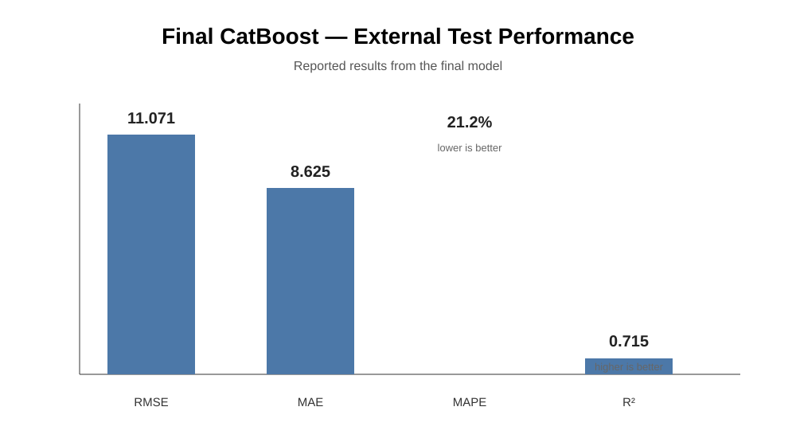
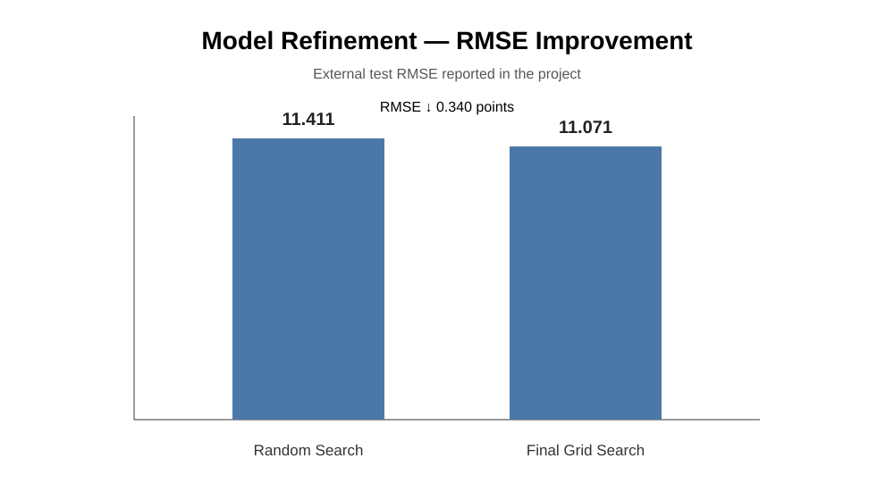
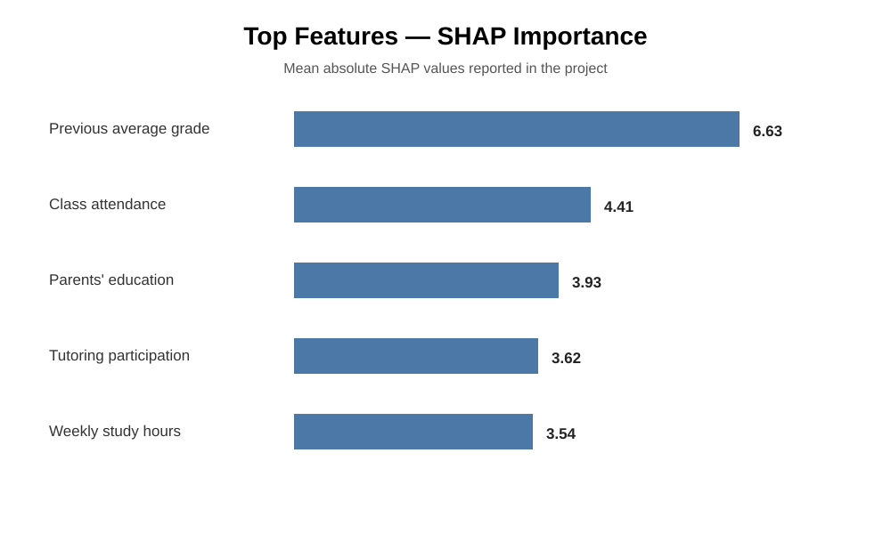

# End-to-End Predictive Analytics Case

> **School Performance Prediction · Machine Learning · FIA MBA**

An end-to-end predictive analytics case focused on predicting students' final grades and understanding which factors contribute most to model predictions.

**1,976 students · 12 explanatory variables · 8 ML models · CatBoost · SHAP**

## Executive summary

The project evaluates multiple tree-based regression algorithms to predict final student grades. The workflow covers data preparation, model benchmarking, hyperparameter optimization, external testing and model interpretability.

The final **CatBoost** model achieved:

| Metric | External Test |
|---|---:|
| **RMSE** | **11.071** |
| **MAE** | **8.625** |
| **MAPE** | **21.2%** |
| **R²** | **0.715** |

The analysis also identified **previous academic performance, class attendance, parents' education, tutoring participation and weekly study hours** among the most influential variables according to mean absolute SHAP values.

### Key visual outputs

---

## Business problem

A private high school wants to understand which factors are associated with students' final academic performance and use analytical insights to support educational and student-support initiatives.

The project addresses two questions:

1. **Prediction:** which algorithm provides the lowest prediction error for final grades?
2. **Interpretability:** which student characteristics contribute most to model predictions?

The objective is not to treat the predicted grade as an exact outcome, but to use predictive analytics to identify patterns and support prioritization of student groups for further intervention.

---

## Dataset

The dataset contains **1,976 student-level observations** and **12 explanatory variables**, combining numerical and categorical features.

### Feature groups

**Academic performance and study**
- Weekly study hours
- Class attendance
- Previous average grade
- Tutoring participation
- Extracurricular activities

**Routine and habits**
- Works while studying
- Study shift
- Commute time
- Own transportation

**Family context**
- Parents' education level
- Internet access at home
- Number of siblings

**Target:** final grade.

---

## Analytical approach

### 1. Train/test split

- **80% training**
- **20% external test**
- Fixed `random_state=123`

The external test set was kept separate from model optimization to provide an independent final evaluation.

### 2. Preprocessing

Categorical variables were encoded with **One-Hot Encoding** for models that require numerical inputs.

**CatBoost** was handled separately using its native categorical-feature support.

### 3. Model benchmarking

Eight tree-based regression algorithms were evaluated:

- Decision Tree
- Random Forest
- AdaBoost
- Gradient Boosting
- HistGradientBoosting
- XGBoost
- LightGBM
- CatBoost

### 4. Hyperparameter optimization

The optimization process was performed in two stages.

**Random Search**
- `RandomizedSearchCV`
- 5-fold cross-validation
- 100 random configurations per algorithm

**Grid Search**
- Focused on the best-performing CatBoost configuration
- 405 local combinations
- Additional stability/overfitting filtering

This two-stage approach was used to first explore the hyperparameter space broadly and then refine a promising region.

---

## Final model

The selected model was **CatBoost** with:

    depth = 3
    iterations = 213
    learning_rate = 0.0341
    l2_leaf_reg = 0.1789
    subsample = 0.7342

### External test performance

| Metric | Random Search | Final Model |
|---|---:|---:|
| RMSE | 11.411 | **11.071** |
| MAE | 8.897 | **8.625** |
| MAPE | 22.5% | **21.2%** |
| R² | 0.697 | **0.715** |

The final refinement reduced RMSE by **0.340 points** and increased R² from **0.697 to 0.715** on the reported external test evaluation.

---

## Model interpretability

Three complementary approaches were used:

- Impurity-based feature importance
- Permutation Importance
- **SHAP**

The project found broadly consistent importance patterns across the methods.

### Top features by mean absolute SHAP

| Feature | Mean absolute SHAP |
|---|---:|
| Previous average grade | **6.63** |
| Class attendance | **4.41** |
| Parents' education | **3.93** |
| Tutoring participation | **3.62** |
| Weekly study hours | **3.54** |

These values describe how much each feature contributes to the model's predictions on average. They should not be interpreted as causal effects.

---

## Business interpretation

The analysis suggests that previous academic performance and attendance are particularly important signals for predicting final grades, while family-context and study-support variables also contribute materially to the model.

A practical application could therefore be to use the model as a **prioritization and diagnostic tool**:

1. Identify groups with elevated predicted risk.
2. Investigate the characteristics associated with those predictions.
3. Design targeted educational support.
4. Measure outcomes over time.
5. Avoid interpreting model associations as evidence of causal impact without an appropriate experimental or quasi-experimental design.

---

## Limitations

- The final model has an RMSE of approximately **11 points on a 0–100 scale**.
- Performance is specific to the population and data-generating process represented in the dataset.
- Some categorical groups contain relatively few observations.
- MAPE can be unstable or difficult to interpret for low target values.
- Feature importance and SHAP explain model behavior; they do **not** establish causality.
- The model should support prioritization and analysis rather than be treated as an exact prediction of an individual student's final grade.

---

## Reproducibility

The repository includes:

    desempenho-escolar-ml/
    ├── README.md
    ├── requirements.txt
    ├── data/
    │   └── Desempenho_Escolar_Dados-1.txt
    ├── images/
    │   ├── final_model_performance.svg
    │   ├── rmse_refinement.svg
    │   └── shap_top_features.svg
    └── notebooks/
        └── Case_Desempenho_Escolar_Modelo_Projecao_RenanCorreia.ipynb

Install the dependencies with:

    pip install -r requirements.txt

Then open the notebook with Jupyter.

---

## Tech stack

**Python · Pandas · NumPy · Scikit-learn · XGBoost · LightGBM · CatBoost · SHAP · Matplotlib · Seaborn · Jupyter**

---

## Academic context

Developed as **Estudo de Caso 3 — Case H (Desempenho Escolar)** for the **MBA em Analytics, Inteligência Artificial e Data Science — FIA**.

---

## Author

**Renan Correia**

MBA in Analytics, Artificial Intelligence and Data Science — FIA

Interests: **Data Analytics · Growth Analytics · CRM · Machine Learning · AI**
